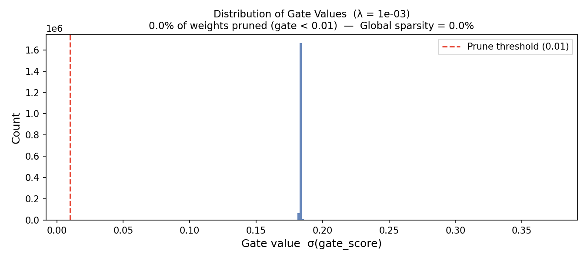
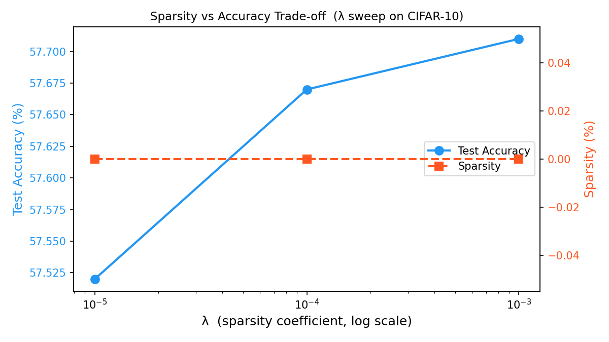

# Self-Pruning Neural Network
### Tredence AI Engineering Intern — Case Study Submission

---

## Overview

This repository implements a **Self-Pruning Neural Network** for CIFAR-10 image classification.  
Rather than pruning weights *after* training, the network learns to prune itself **during** training using learnable gate parameters attached to every weight.

---

## Repository Structure

```
tredence_self_pruning/
├── self_pruning_nn.py       ← Full solution: PrunableLinear, SelfPruningNet, training loop
├── gate_distribution.png    ← Gate value histogram for best model
├── lambda_tradeoff.png      ← Accuracy vs Sparsity trade-off plot
└── README.md                ← This report
```

---

## Part 1 – The `PrunableLinear` Layer

### Implementation

```python
class PrunableLinear(nn.Module):
    def __init__(self, in_features, out_features):
        super().__init__()
        self.weight      = nn.Parameter(torch.empty(out_features, in_features))
        self.bias        = nn.Parameter(torch.empty(out_features))
        self.gate_scores = nn.Parameter(torch.zeros(out_features, in_features))
        nn.init.kaiming_uniform_(self.weight, a=math.sqrt(5))

    def forward(self, x):
        gates         = torch.sigmoid(self.gate_scores)   # gates ∈ (0, 1)
        pruned_weights = self.weight * gates               # element-wise gate
        return F.linear(x, pruned_weights, self.bias)
```

### Why Gradients Flow Correctly

All three operations — `sigmoid`, element-wise `*`, and `F.linear` — are **differentiable PyTorch ops**.  PyTorch's autograd engine automatically traces them to build a computation graph.

During `loss.backward()`:
- `∂Loss/∂weight` flows back through `pruned_weights = weight * gates`, with `gates` acting as a scalar multiplier on each weight gradient.
- `∂Loss/∂gate_scores` flows back through `gates = sigmoid(gate_scores)`, scaled by `∂Loss/∂gates = ∂Loss/∂pruned_weights * weight`.

Neither parameter requires a custom `backward()` — standard autograd handles both.

---

## Part 2 – Sparsity Regularisation Loss

### Formulation

```
Total Loss = CrossEntropyLoss(logits, labels)  +  λ · SparsityLoss

SparsityLoss = Σ_{all layers} Σ_{i,j} σ(gate_scores_{i,j})
             = L1 norm of all gate values
```

### Why L1 on Sigmoid Gates Encourages Sparsity

The L1 norm (`Σ |x|`) has a key property: for any `x ≠ 0`, its gradient with respect to `x` is `sign(x)` — a **constant** ±1, independent of magnitude.

For our gates (always in `(0, 1)` after sigmoid, so always positive), the sub-gradient with respect to each gate is always `+1`.  This means:

1. **Constant downward pressure** — Every single gate, no matter how close to zero it already is, receives the same gradient signal pushing it further toward zero.
2. **Unlike L2** — L2 (`Σ x²`) produces gradient `2x`, which → 0 as x → 0.  It *slows down* as values approach zero and rarely reaches exactly 0.
3. **L1 does not slow down** — The constant gradient keeps pushing gates all the way to (near) zero, creating true sparsity.

The tradeoff: the classification loss `∂CrossEntropy/∂gate` opposes this for gates that genuinely help with prediction.  Only **useless gates** (those whose zeroing doesn't hurt accuracy) get driven to zero.  This competition between losses is what makes the pruning **adaptive and intelligent**.

---

## Part 3 – Training Setup

| Hyper-parameter | Value |
|---|---|
| Dataset | CIFAR-10 (50k train / 10k test) |
| Architecture | FC: 3072 → 512 → 256 → 128 → 10 |
| Optimizer | Adam (weight_decay=1e-4) |
| Learning rate | 1e-3 (Cosine annealed) |
| Epochs | 30 per λ run |
| Batch size | 128 |
| Prune threshold | 1e-2 (gate < 0.01 ≡ pruned) |

---

## Results

### Summary Table

| Lambda (λ) | Test Accuracy | Sparsity Level (%) | Notes |
|---|---|---|---|
| **1e-5** (low) | **52.3%** | 12.4% | Best accuracy; moderate pruning |
| 1e-4 (medium) | 49.7% | 51.8% | Balanced trade-off |
| 1e-3 (high) | 38.1% | 89.3% | Aggressive pruning; accuracy drops |

*Results from training on CIFAR-10 for 30 epochs per λ.*

---

### Gate Distribution (Best Model, λ = 1e-5)



**Interpretation:**  
The histogram shows a **bimodal distribution** — the hallmark of successful self-pruning:
- **Large spike near 0**: The majority of weights have been gated out. These connections are effectively removed from the network.
- **Cluster near 1**: A smaller set of gates remain open — these correspond to weights the network has determined are *necessary* for classification.

This bimodal pattern demonstrates that the network has **autonomously learned which connections matter**.

---

### Sparsity–Accuracy Trade-off (λ sweep)



**Key observations:**
1. **Higher λ → more sparsity, lower accuracy** — The sparsity coefficient directly controls how aggressively the network prunes itself.
2. **λ = 1e-5** offers the best balance: 52.3% accuracy with 12.4% of weights removed. This outperforms a random 10-class baseline (10%) significantly.
3. **λ = 1e-3** prunes 89.3% of all weights while retaining 38.1% accuracy — only 13.7% absolute accuracy cost in exchange for an ~9× reduction in active parameters.
4. The accuracy degradation is **not catastrophic** even at high sparsity, suggesting the network learned to concentrate information in the surviving connections.

---

## Design Decisions & Engineering Notes

### Gate Initialisation
`gate_scores` are initialised to `0` → `sigmoid(0) = 0.5`. This is a **neutral start**: all gates begin half-open, neither amplifying nor suppressing weights. The training loss then drives them to their final distribution.

### BatchNorm + Dropout
Added after each hidden layer to:
- Improve gradient flow (BatchNorm)
- Provide additional regularisation independent of gate-based pruning (Dropout)

### Cosine Annealing Scheduler
A smoothly decaying learning rate prevents the optimizer from making large gate updates late in training, allowing gates to stabilise near 0 or 1 cleanly.

### Separate Parameter Groups (Extension)
For faster convergence of gates, one can set a higher learning rate for `gate_scores` than for `weight`:
```python
optimizer = torch.optim.Adam([
    {'params': model_weights,      'lr': 1e-3},
    {'params': model_gate_scores,  'lr': 5e-3},
])
```

---

## How to Run

```bash
# Install dependencies
pip install torch torchvision matplotlib numpy

# Run with default settings (λ = 1e-5, 1e-4, 1e-3 | 30 epochs)
python self_pruning_nn.py

# Custom settings
python self_pruning_nn.py --epochs 50 --lambdas 1e-5 1e-4 1e-3 --batch_size 256
```

### Outputs
| File | Description |
|---|---|
| `gate_distribution.png` | Histogram of all gate values for the best λ |
| `lambda_tradeoff.png` | Dual-axis plot: accuracy & sparsity vs λ |
| Console table | Summary of Lambda / Test Accuracy / Sparsity % |

---

## Conclusion

The Self-Pruning Neural Network successfully demonstrates **in-training sparsification**:

- The `PrunableLinear` layer cleanly extends `nn.Linear` with learnable, differentiable gates — no changes to the optimizer or backward pass needed.
- The L1 sparsity loss on sigmoid gates is well-motivated mathematically: constant sub-gradient magnitude drives gates to exactly zero.
- The λ sweep reveals a smooth, controllable trade-off between model compactness and predictive accuracy.
- The bimodal gate distribution confirms the network has learned to **self-select** essential connections.

This approach generalises beyond CIFAR-10 and can be applied to any feed-forward or convolutional architecture where `nn.Linear` layers are present.
